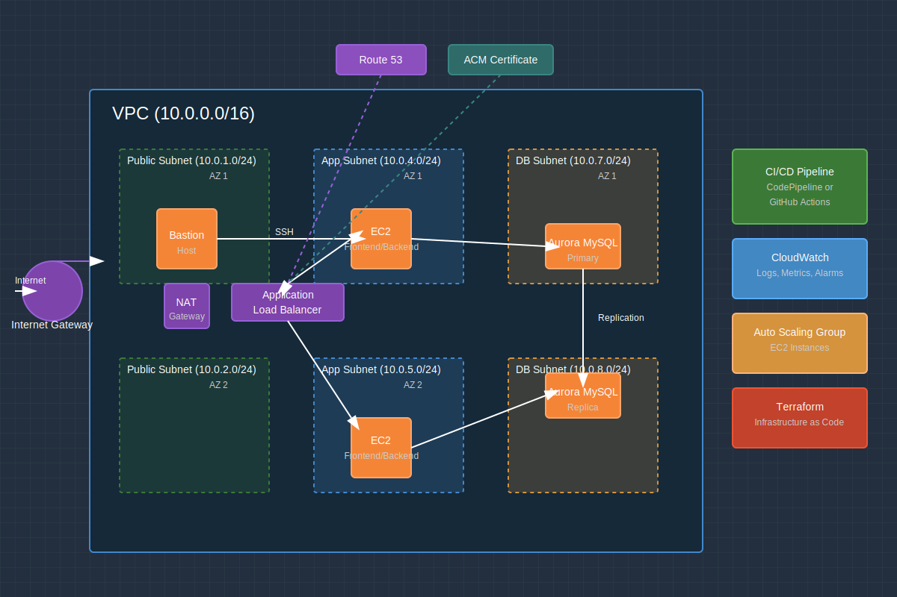

# AWS DevOps Full-Stack Portfolio Project

 
 

 
 


## ✅ Project Overview

A production-ready, highly available full-stack web application deployed on AWS using DevOps best practices. This project demonstrates a secure, scalable architecture with automated infrastructure provisioning, continuous integration/deployment, and comprehensive monitoring.

## ⚙️ Tech Stack

### Infrastructure & DevOps
- **Cloud Provider**: AWS
- **Infrastructure as Code**: Terraform
- **CI/CD**: AWS CodePipeline + CodeBuild / GitHub Actions
- **Monitoring**: Amazon CloudWatch
- **Version Control**: Git

### Application
- **Frontend**: React.js
- **Backend**: Node.js with Express
- **Database**: Aurora MySQL (AWS RDS)
- **Authentication**: JWT

### AWS Services
- **Compute**: EC2 with Auto Scaling Groups
- **Networking**: VPC, Subnets, Security Groups, Route 53
- **Load Balancing**: Application Load Balancer (ALB)
- **Storage**: S3 (for deployment artifacts)
- **Database**: Aurora MySQL (RDS)
- **Security**: ACM (for SSL/TLS certificates)
- **Deployment**: CodeDeploy / S3 + EC2 User Data

## 🗺️ Architecture Diagram



The architecture follows a multi-AZ design to ensure high availability:

- **Public Subnets**: Contain the bastion host, NAT Gateway, and Application Load Balancer
- **Application Subnets**: Host the EC2 instances running the frontend and backend applications
- **Database Subnets**: Contain the Aurora MySQL cluster with primary and replica instances
- **Security**: Network segmentation with security groups, IAM roles, and HTTPS encryption

## 🚀 CI/CD Workflow Summary

This project implements a robust CI/CD pipeline using either AWS CodePipeline or GitHub Actions:

1. **Source Stage**: Code changes trigger the pipeline when pushed to the main branch
2. **Build Stage**: 
   - Install dependencies
   - Run automated tests
   - Build frontend assets
   - Package application code
3. **Deploy Stage**:
   - Upload deployment package to S3
   - Deploy to EC2 instances via CodeDeploy
   - Run deployment lifecycle scripts
4. **Verify Stage**:
   - Health checks verify successful deployment
   - Automated notifications on success/failure

The CI/CD configuration supports zero-downtime deployments and rollback capabilities.

## 🔐 Security & Monitoring

### Security Features
- VPC with public/private subnet isolation
- Security groups with least privilege access
- IAM roles with fine-grained permissions
- HTTPS encryption with ACM certificates
- Secure parameter storage for secrets
- Bastion host for secure SSH access

### Monitoring & Alerts
- CloudWatch Logs for application, access, and error logs
- CloudWatch Metrics for system and application performance
- CloudWatch Alarms for critical thresholds
- Custom CloudWatch Dashboard for system visibility
- Automated alerting via SNS

## 🧠 What I Learned / DevOps Skills Applied

This project demonstrates proficiency in:

- **Infrastructure Design**: Creating resilient, scalable cloud architectures
- **Infrastructure as Code**: Using Terraform to define and provision AWS resources
- **CI/CD Pipeline Configuration**: Setting up automated build, test, and deployment workflows
- **Security Implementation**: Applying defense-in-depth security principles
- **Monitoring & Alerting**: Configuring comprehensive monitoring and notification systems
- **High Availability Design**: Implementing multi-AZ deployments for resilience
- **Database Management**: Setting up and configuring managed database services
- **Full-Stack Development**: Building React frontend and Node.js backend applications

## 📦 How to Deploy (Setup Instructions)

### Prerequisites
- AWS Account with appropriate permissions
- Terraform (v1.0+) installed
- AWS CLI configured with access credentials
- EC2 Key Pair created for SSH access (see [deployment guide](docs/deployment.md#setting-up-an-ec2-key-pair-for-deployment))
- Domain name (optional, for HTTPS)

### Deployment Steps

1. **Create EC2 Key Pair**:
   ```bash
   # Create key pair for SSH access
   aws ec2 create-key-pair \
       --key-name devops-portfolio-key \
       --query 'KeyMaterial' \
       --output text > ~/.ssh/devops-portfolio-key.pem
   chmod 400 ~/.ssh/devops-portfolio-key.pem
   ```

2. **Clone the repository**:
   ```bash
   git clone https://github.com/yourusername/aws-devops-fullstack-portfolio.git
   cd aws-devops-fullstack-portfolio
   ```

3. **Configure Terraform variables**:
   ```bash
   cd infra
   cp terraform.tfvars.example terraform.tfvars
   # Edit terraform.tfvars with your specific configurations (including ec2_key_name)
   ```

4. **Initialize and apply Terraform**:
   ```bash
   terraform init
   terraform plan
   terraform apply
   ```

5. **Set up CI/CD pipeline**:
   ```bash
   cd ../ci/aws
   ./setup-pipeline.sh
   # OR
   # Configure GitHub Actions in your repository settings
   ```

6. **Configure monitoring**:
   ```bash
   cd ../monitoring
   ./setup-monitoring.sh
   ```

For detailed deployment instructions, see [Deployment Guide](docs/deployment.md).

## License

This project is licensed under the MIT License - see the LICENSE file for details.
